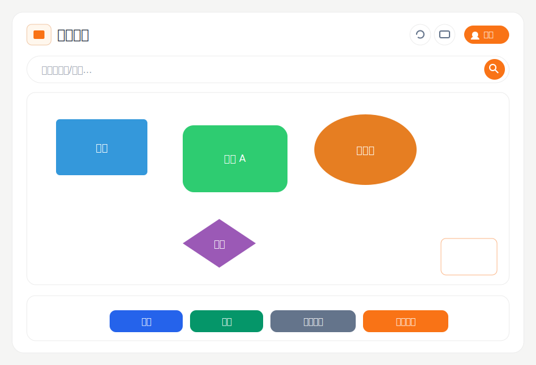
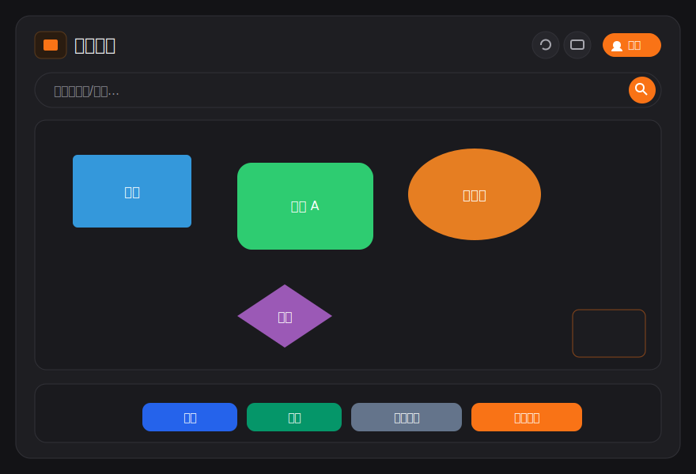

# 区域导航 · Area Navigator

一个**纯前端、零后端**的区域陈列与商品管理演示项目。在一张可缩放、可平移的画布上绘制任意"区域"（支持方形 / 圆角 / 圆形 / 菱形），并在每个区域内管理商品（增删改、搜索、批量导入、批量配图、收藏、导出）。所有数据保存在浏览器本地的 **IndexedDB** 中，不上传任何服务器。

> A client-side-only demo for navigating display areas and managing products on a zoomable canvas. All data lives in the browser's IndexedDB — nothing is sent to any server.

**🔗 在线体验 / Live demo:** https://dottiemochi.github.io/floorplan-product-manager-/

## 🖼️ 界面预览

| 浅色 Light | 深色 Dark |
|:---:|:---:|
|  |  |

## ✨ 功能

- **画布地图**：缩放、平移、吸附对齐、小地图（mini-map）快速跳转
- **区域管理**：添加 / 编辑（名称、颜色、文字方向、形状、尺寸）/ 复制 / 删除 / 锁定 / 多选 / 样式刷
- **商品管理**：增删改、详情查看、多选、批量移动 / 删除、收藏、按列数缩放、排序、搜索高亮
- **扫码定位 / 录入**：支持摄像头扫码、选择图片扫码、条码下方数字 OCR 兜底；游客可扫码定位商品，工作人员 / 设计者可扫码录入条码
- **批量导入**：从 Excel / CSV 导入商品（自动识别含"规格"的表头行 + 字段映射）；按条码匹配批量导入图片
- **导入 / 导出**：整套数据的 JSON 备份与恢复
- **三级角色**：游客 / 工作人员 / 设计者，按角色控制可见操作
- **界面**：扁平精炼风格 + 统一线性图标，支持**深色模式**（跟随系统）、响应式（手机 / 桌面），并补充了无障碍标签（aria-label / alt、Esc 关闭弹窗）

## 🚀 运行

这是纯静态项目，但用了 ES Module（`<script type="module">`），需要通过 HTTP 服务访问，不能直接双击 `file://` 打开。

任选一种方式：

```bash
# Python
python -m http.server 8080

# 或 Node
npx serve .
```

然后浏览器打开 `http://localhost:8080`。也可以用 VS Code 的 **Live Server** 扩展打开 `index.html`。

## 📷 扫码说明

- 摄像头扫码需要 **HTTPS** 或 `localhost` 环境；GitHub Pages 自带 HTTPS，可以正常使用。
- 如果摄像头无法打开，或条码在商品照片里比较小，可以在扫码弹窗中选择图片扫码。
- 图片扫码会依次尝试条码识别、一维码识别和数字 OCR；OCR 结果会校验 EAN/UPC 条码，无法确认时会让你手动确认。
- 如果扫码后提示"未找到"，表示条码已识别成功，但当前本地商品库还没有录入这个条码。

## 🔐 关于"角色密码"——请务必阅读

本项目**没有后端**，所有代码都在浏览器里运行。因此：

> **前端的角色密码只是一个"软门槛"，不是真正的安全机制。** 任何人都能通过浏览器开发者工具查看密码、绕过校验或直接修改权限。**切勿用它保护任何真实、敏感的数据。**

密码在 [`js/store.js`](js/store.js) 的 `ROLE_PASSWORDS` 中配置，**默认留空**（即任何人都可自由切换角色）。如果你只是想要一个轻量的 UI 门槛，可以自行填入：

```js
export const ROLE_PASSWORDS = {
  staff: '',      // 留空 = 无需密码
  designer: ''
};
```

如需真正的访问控制，请在前面加一层带鉴权的后端。

## 🧱 技术栈

- 原生 HTML / CSS / JavaScript（ES Modules），无构建步骤、无框架
- [SheetJS (xlsx)](https://sheetjs.com/) — 解析 Excel / CSV（CDN 引入）
- [JSZip](https://stuk.github.io/jszip/) — 打包下载图片（CDN 引入）
- [html5-qrcode](https://github.com/mebjas/html5-qrcode) — 摄像头 / 图片扫码（CDN 引入）
- [Quagga2](https://github.com/ericblade/quagga2) — 一维商品条码识别兜底（CDN 引入）
- [Tesseract.js](https://tesseract.projectnaptha.com/) — 条码数字 OCR 兜底（CDN 引入）
- [Tabler Icons](https://tabler.io/icons) — 线性图标字体（CDN 引入）
- 浏览器 IndexedDB — 本地持久化

## 📁 结构

```
.
├─ index.html          # 页面骨架 + 弹窗结构
├─ css/
│  └─ style.css        # 全部样式（含风格主题与深色模式）
└─ js/
   ├─ main.js          # 启动入口
   ├─ store.js         # 全局状态、角色与权限
   ├─ areaStore.js     # IndexedDB 持久化 + 撤销/重做
   ├─ canvasManager.js # 画布绘制与交互
   ├─ productManager.js# 商品网格与操作
   ├─ scanner.js       # 摄像头扫码、图片扫码与 OCR 兜底
   ├─ uiController.js  # UI 事件与弹窗逻辑
   ├─ batchImport.js   # Excel/CSV 与图片批量导入
   └─ utils.js         # 通用工具
```

## 📄 许可

[MIT](LICENSE) © Daisy Mimi

## 🤝 协作致谢

本项目在功能优化和代码实现过程中使用了 Claude 与 Codex 辅助协作。
